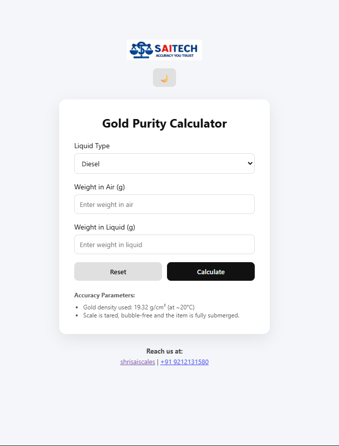
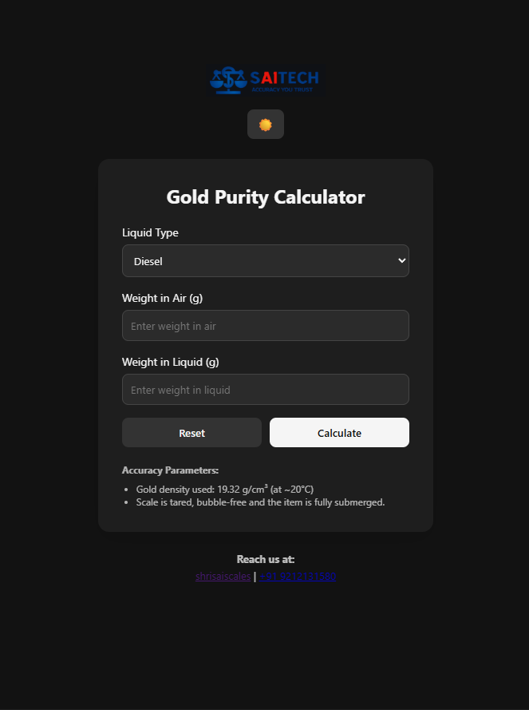

# 🟡 Gold Purity Calculator

A professional web-based Gold Purity Calculator built using the hydrostatic weighing method.

This tool calculates gold purity percentage and karat value based on:
- Weight in Air
- Weight in Liquid
- Selected Liquid Type

The application features a modern minimalist UI, dark mode toggle, responsive design, and dynamic formula adjustment based on liquid density.

---

## 🚀 Features

- Dynamic liquid selection (Water, Diesel, Isopropyl Alcohol, Kerosene Oil)
- Automatic density adjustment
- Purity % and Karat calculation
- Dark / Light mode toggle (with memory)
- Animated transitions
- Fully responsive design
- Click-to-call phone support
- Business footer integration

---

## 🧮 Calculation Formula

Sample Density:

Density = (Weight in Air / (Weight in Air − Weight in Liquid)) × Liquid Density

Purity Percentage:

Purity % = (Sample Density / 19.32) × 100

Karat Value:

Karat = (Purity % × 24) / 100

> Gold reference density used: 19.32 g/cm³ (at ~20°C)

---

## 🧪 Accuracy Parameters

- Scale must be properly tared
- Item must be fully submerged
- No air bubbles present
- Measurement temperature around 20°C

---

## 📱 Tech Stack

- HTML5
- CSS3
- JavaScript (Vanilla JS)

No backend required.

---

## 🌍 Deployment

This project is deployed using GitHub Pages.

---

## 🖼 Demo Preview

### Light Mode

### Dark Mode

---

